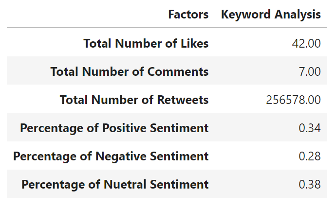
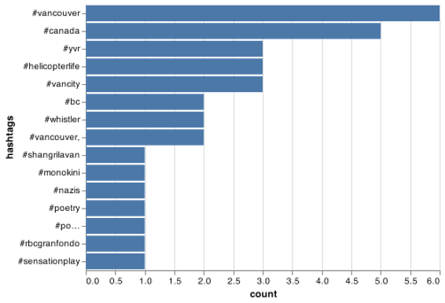

<!-- README.md is generated from README.Rmd. Please edit that file -->

# rtweetlytics

<!-- badges: start -->

[](https://opensource.org/licenses/MIT)
[](https://github.com/UBC-MDS/rtweetlytics/actions)
[](https://codecov.io/gh/UBC-MDS/rtweetlytics)

<!-- badges: end -->

-   Authors: Mahsa Sarafrazi, Shiva Shankar Jena, Amir Shojakhani,
    Mahmoodur Rahman

An R package to extract twitter data, analyzed and plot top occuring
hashtags

## Overview

The goal of rtweetlytics is to extract, analyze and plot twitter data.
It provides functions to extract twitter data, clean tweets, analyze
tweets and plot hashtags frequency.

## Functions

| Function Name  | Input                                               | Output    | Description                                                                                                                                                                             |
|----------------|-----------------------------------------------------|-----------|-----------------------------------------------------------------------------------------------------------------------------------------------------------------------------------------|
| get_store()    | `bearer_token`, `keyword`, `start_date`, `end_date` | Dataframe | Extract twitter data and save as `.csv`                                                                                                                                                 |
| clean_tweets() | `PATH`,                                             | String    | Cleans the text in the tweets and returns as new columns in the dataframe. The cleaning process includes converting into lower case, removal of punctuation, hastags and hastag counts. |
| analytics()    | `.csv`                                              | Dataframe | Analyze the clean data frame extracted from twitter website, and returns a tibble including metrics of analytics.                                                                       |
| plotting()     | `.csv`, `col_text`                                  | Image     | The plotting function creates a bar-chart plot of most occurring hashtags.                                                                                                              |

## Installation

The development version of rtweetlytics can be installed from
[GitHub](https://github.com/) with:

``` r
# install.packages("devtools")
devtools::install_github("UBC-MDS/rtweetlytics")
```

## Features

The package is an assimilation of four independent functions:

1.  `get_store()`: Extract data from twitter through calling API and
    provide csv file as output and create a dataframe.

2.  `clean_tweets()`: Cleans the text in the tweets and returns as new
    columns in the dataframe. The cleaning process includes converting
    into lower case, removal of punctuation, hastags and hastag counts.

3.  `analytics()`: Analyze the clean data frame extracted from twitter
    website, and returns a tibble including metrics of analytics.

4.  `plotting()`: The plotting function creates a bar-chart plot of most
    occurring hashtags.

## Example

### Load the library

``` r
library(rtweetlytics)
```

### 1. Downloading data and creating dataframe

The first function in our library is the `rtweetlytics::get_store()`.
This function will require tghe developer to obtain bearer token from
the twitter API development website.

``` r
tweets = rtweetlytics::get_store(
            bearer_token,
            keyword="vancouver",
            start_date="2022-01-12",
            end_date="2022-01-17")
head(tweets)
```

    #>                                                                                                                                      data.text
    #> 1 RT @TrishKurralinga: @Ctl_Alt_Del @PCKJ3627 I am reading a number of teachers are pulling the pin to ensure they don’t bring Omicron home f…
    #> 2                                              As Omicron Crests, Booster Shots Are Keeping Americans Out of Hospitals https://t.co/ms03kYYNO8
    #>   data.author_id                               data.referenced_tweets data.lang
    #> 1   2.996786e+09 list(type = "retweeted", id = "1484905705740333059")        en
    #> 2   1.297973e+18                                                 NULL        en
    #>       data.id          data.created_at        data.source data.reply_settings
    #> 1 1.48504e+18 2022-01-22T23:59:59.000Z Twitter for iPhone            everyone
    #> 2 1.48504e+18 2022-01-22T23:59:59.000Z      WordPress.com            everyone
    #>   data.conversation_id data.in_reply_to_user_id
    #> 1          1.48504e+18                       NA
    #> 2          1.48504e+18                       NA
    #>   data.public_metrics.retweet_count data.public_metrics.reply_count
    #> 1                                 7                               0
    #> 2                                 0                               0
    #>   data.public_metrics.like_count data.public_metrics.quote_count
    #> 1                              0                               0
    #> 2                              0                               0

### 2. Cleaning data

The second function in our library is the
`rtweetlytics::clean_tweets()`. This function cleans the data to gets
tweet texts, word counts.

``` r
PATH <- "../output/tweets_response.csv"
tweets_df <- rtweetlytics::clean_tweets(PATH, tokenization=TRUE, word_count=TRUE)
head(tweets_df)
```

    #>   X          source author_id          created_at conversation_id lang
    #> 1 1 Twitter Web App 282220986 2022-01-17 23:59:59    1.483228e+18   en
    #> 2 2   Talon Android 932214247 2022-01-17 23:59:58    1.483228e+18   en
    #>   reply_settings                                    referenced_tweets
    #> 1       everyone [{'type': 'retweeted', 'id': '1483167691825418241'}]
    #> 2       everyone [{'type': 'retweeted', 'id': '1482901087296311300'}]
    #>             id
    #> 1 1.483228e+18
    #> 2 1.483228e+18
    #>                                                                                                                                           text
    #> 1 RT @MaximeBernier: Some mainstream media are finally recognizing that the covid hysteria has gone too far and are beginning to question it.…
    #> 2 RT @DrJ56013122: I have yet to see a single research article convincingly showing that a booster reduces transmission or reduces the likeli…
    #>   in_reply_to_user_id retweetcount reply_count like_count quote_count
    #> 1                  NA          931           0          0           0
    #> 2                  NA           30           0          0           0
    #>                                                                                                                 clean_tweets
    #> 1    some mainstream media are finally recognizing that the covid hysteria has gone too far and are beginning to question it
    #> 2 i have yet to see a single research article convincingly showing that a booster reduces transmission or reduces the likeli
    #>                                                                                                                 clean_tokens
    #> 1    some,mainstream,media,are,finally,recognizing,that,the,covid,hysteria,has,gone,too,far,and,are,beginning,to,question,it
    #> 2 i,have,yet,to,see,a,single,research,article,convincingly,showing,that,a,booster,reduces,transmission,or,reduces,the,likeli
    #>   word_count
    #> 1         20
    #> 2         20

### 3. Analyzing data

Our third function `rtweetlytics::analytic()` analyses the data to give
a resulting dataframe showing total Number of Likes, total Number of
Comments, total Number of Retweets, percentage of Positive Sentiments,
percentage of Neutral Sentiments, and percentage of Negative Sentiments.

``` r
results <- rtweetlytics::analytics(tweets_df)
head(results)
```



### 4. Creating plot

In the last and final function we are using `rtweetlytics::plotting()`
to further clean the data to extract hastags and plot the top 15 tags.

``` r
hash_plot <-  rtweetlytics::plotting(tweets_df, text)
hash_plot
```



## Contributors

The names of core development team is listed below.

|        Name        |  GitHub Handle  |
|:------------------:|:---------------:|
|  Mahsa Sarafrazi   | @mahsasarafrazi |
| Shiva Shankar Jena |   @shivajena    |
|  Amir Shojakhani   |   @amirshoja    |
|  Mahmoodur Rahman  |   @mahm00d27    |

Please note that this project is released with a Code of Conduct. By
contributing to this project, one implies to agree to abide by its
terms.

## License

`rtweetlytics` is licensed under the terms of the MIT license.
